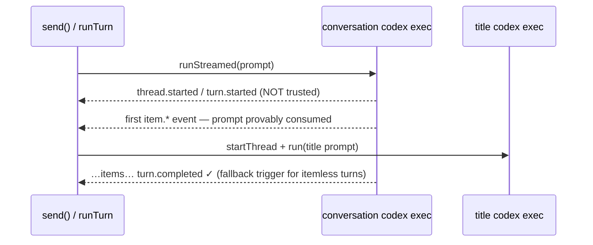

# Codex first-message truncation — diagnosis and implementation plan

**Date:** 2026-07-23
**Status:** Diagnosis reviewed; implementation not started.
**Scope:** `src/main/codex.ts` + `test/codexSession.test.ts` only. Claude's title path
(`claude.ts` / `generateClaudeTitle`) is a different runtime with no observed failure and
is deliberately untouched.

---

## 1. Symptom

Intermittently, the very first message of a new Codex chat is silently lost:

- The persisted chat contains the first user message but **no assistant message and no
  turn-stats record**.
- The chat returns to `idle` as if the turn succeeded.
- The next message the user sends (e.g. `?`) becomes the first prompt the conversation
  thread actually consumes.

Matching Codex rollouts show:

- The **title thread** and the **conversation thread** start at essentially the same
  millisecond.
- The title thread completes normally (its prompt embeds the user's text by design —
  `buildTitlePrompt(userText)` — so "the title thread received the original prompt" is
  expected, *not* evidence of prompt cross-wiring).
- The conversation rollout records `task_started` but **never records a `user_message`**,
  and its SDK event stream ends without `turn.completed` or `turn.failed`.

## 2. What the code confirms

Three findings verified directly against the source:

### 2.1 The title process spawns *before* the conversation process, same tick

In `send()` (`src/main/codex.ts:384-406`):

```ts
void this.maybeGenerateTitle()          // ← spawns title `codex exec` in its sync prefix
this.emit({ type: 'meta', ... })
this.pending.push(this.buildPendingTurn(text, attachments, messageId))
void this.drain()                       // ← conversation `codex exec` spawns microtasks later
```

`maybeGenerateTitle → generateCodexTitle → codex.startThread(...) → thread.run(...)`
launches the title's child process synchronously before `drain()` ever runs. This matches
the same-millisecond rollouts and explains the asymmetry: the process spawned *first*
wins any cold-start initialization race; the conversation process, spawned second, is the
one that dies.

### 2.2 A truncated stream is silently converted into a successful empty turn

In `runTurn` (`src/main/codex.ts:587-592`), the `for await` loop simply exits when the
SDK's event generator ends. **Nothing checks that a terminal event
(`turn.completed`/`turn.failed`) ever arrived.** The `finally` block cleans up, `drain()`
(`codex.ts:553-558`) emits `idle` and saves. The turn-stats event is only pushed from
`onTurnCompleted` (`codex.ts:858`), so a truncated stream produces none.

This reproduces the persisted evidence exactly: user message present, no assistant
message, no turn record, chat idle.

### 2.3 The app did not close the stream

No app-side path could have ended the stream early: the abort signal was not fired,
`disposed` was false, and the rollout watcher only reads files. The truncation genuinely
originated inside the SDK / the `codex exec` child process.

## 3. Root-cause verdict

**Two app bugs, one external trigger.**

- **Bug A (removable trigger):** the app spawns two *cold* `codex exec` processes
  simultaneously on every first message. The likely failure mechanism is contention on
  shared `~/.codex` state during first-run initialization — the classic candidate is the
  auth token refresh in `auth.json` (two concurrent refreshes; the loser's token is
  invalidated), plus session-dir/config init. The conversation child dies during startup
  (after `task_started`, before consuming the submission) and exits cleanly enough that
  the SDK surfaces a plain end-of-stream rather than an error.
- **Bug B (load-bearing):** the app treats a terminal-event-less stream as success. This
  converts *any* child-process death — whatever the cause — into silent data loss.

**Epistemic honesty:** the cold-start race is plausible and consistent with every
observation, but it cannot be *proven* from the app side of the SDK boundary. That is
fine, because the fix does not depend on proving it:

- Fixing only A makes the failure rarer but still silent when it recurs.
- Fixing only B retries straight into the same collision.
- Fixing both removes the known trigger **and** makes any future recurrence visible and
  recoverable. The retry-plus-loud-failure design doubles as instrumentation: if
  truncations continue after the gating fix, they will show up in transcripts instead of
  being eaten — which is exactly how we would learn the trigger was something else.

**Rejected alternatives:**

| Alternative | Why rejected |
|---|---|
| Fixed delay (1–2 s) before starting the title thread | Band-aid on a race; still intermittent, just rarer. |
| Wait for the rollout watcher to see `user_message` | Most literal proof of consumption, but adds polling latency, and the watcher only starts once the thread id is known. The in-band item event is strictly after that record anyway. |
| Serialize the title after the full first turn | Violates the UX constraint; title would land seconds-to-minutes late. |

## 4. Fix part 1 — gate title generation on prompt consumption

### 4.1 The trigger

Start title generation at the **first proof that the conversation thread has consumed
the prompt**, whichever comes first:

1. any `item.started` / `item.updated` / `item.completed` event, or
2. a terminal event (`turn.completed` / `turn.failed`), or
3. the end of the turn in `runTurn`'s `finally`, for any non-retrying exit (interrupt,
   thrown error, final truncation failure).

### 4.2 Why each trigger is correct

- **`thread.started` / `turn.started` are NOT sufficient** — the failed rollout proves
  it: both were emitted during process startup, before the submission was consumed.
- **An item event is model output for this turn.** Codex only produces one after the
  submission was accepted and the `user_message` was recorded in the rollout (items
  strictly follow it). By then the conversation process has finished cold-start init —
  auth refreshed, config loaded, session file created — so a second cold process no
  longer contends with first-run initialization.
- **The terminal-event fallback is mandatory, not defensive.** Turns with zero SDK items
  are legitimate: built-in `image_gen` calls never appear in the `ThreadItem` stream
  (documented at `codex.ts:256-259`), and "silent" turns exist.
- **The `finally` fallback is unconditionally safe:** once the conversation process is
  dead, there is no concurrency hazard at all. It is skipped on the truncation-*retry*
  path (the retried turn will fire the trigger itself).

### 4.3 UX consequence

This is **staggered parallelism, not serialization**. The `deriveTitle(...)` placeholder
still appears instantly; the AI title thread still overlaps ~95 % of the turn. With a
slow-thinking model the title starts a few seconds later than today — acceptable, and
within the stated constraint.



## 5. Fix part 2 — truncated-stream detection, retry, and reporting

### 5.1 Detection

Track two per-turn flags, reset at the top of `runTurn` alongside `itemLoc.clear()`:

- `sawItem` — set on any `item.*` event.
- `sawTerminal` — set on `turn.completed` or `turn.failed`.

After the `for await` loop exits cleanly, the stream was **truncated** iff:

```ts
!sawTerminal && !this.disposed && !this.interrupted && !this.abort.signal.aborted
```

### 5.2 Retry policy — `sawItem` is the duplicate-execution guard

| Case | Action | Rationale |
|---|---|---|
| Truncated, `!sawItem`, not yet retried | Retry the same `PendingTurn` **once**, after a ~300–500 ms backoff | Nothing streamed and the observed rollouts show no `user_message` → the prompt was not consumed, so re-sending cannot duplicate side effects. Backoff because the suspected cause is startup contention. |
| Truncated, `!sawItem`, retry exhausted | Loud error event; `break` | See 5.4. |
| Truncated, `sawItem` (partial turn) | **No automatic retry**; error event; `break` | Commands/edits may already have executed — re-sending risks running them twice. `terminalizeRunning()` already errors out spinning tool cards. |
| Stream ended after user interrupt / mode-change abort / dispose | Nothing (existing behavior) | Expected truncation; mirrors the existing guard at `codex.ts:609`. A mode change mid-retry-window sets `interrupted` + aborts, which correctly suppresses the retry. |

Retry mechanics:

- Structure it exactly like the existing `retriedMissingThread` loop
  (`codex.ts:583-614`) with its **own** flag (`retriedTruncatedStream`); keep the
  missing-thread retry independent.
- **Resume the `threadId`** if `thread.started` delivered one. The half-started rollout
  (`task_started`, no `user_message`) is resumable and preserves thread-id continuity; if
  it turns out to be poisoned, the existing `isMissingCodexThreadError` retry already
  recovers by starting fresh.
- **Attachment temps survive retries for free:** they are deleted in `runTurn`'s
  `finally`, which is outside the retry loop.
- **Turn-stats honesty:** never fabricate a turn record for a truncated turn — its
  absence remains an honest signal.

### 5.3 Optional hardening (skip in v1)

Before retrying, check the rollout file for a `user_message` record instead of trusting
`sawItem` alone — covers the theoretical case where the stream dies with events in
flight. Rejected for v1: couples the retry path to rollout internals for marginal gain.

### 5.4 User-visible behavior

- **The single retry is quiet** (console log only). Flashing "retrying" for a sub-second
  recovery is noise.
- **Failures are loud:**
  - Retry exhausted, nothing consumed:
    > *"Codex exited before reading your message. It was not processed — please send it again."*
  - Partial truncation:
    > *"Codex ended the turn unexpectedly; the output above may be incomplete."*
- Status returns to `idle` either way so the composer stays usable; the user's message
  remains in the transcript for resending.

## 6. Edge cases

| Case | Behavior under the fix |
|---|---|
| **Silent turn** (terminal event, zero items) | Legitimate success; `sawTerminal` → no retry; title fires via terminal fallback; no empty assistant bubble (`ensureCurrent` is lazy). |
| **Image-only turn** | Zero `ThreadItem`s by design; same terminal fallback; `surfaceTurnImages` unaffected. |
| **Tool-first turn** | First `item.started` is a `command_execution` — title fires early, correctly. |
| **Abort before any item** | Interrupt guard blocks retry; title fires from the `finally` fallback (process dead → zero contention; the message stays in the transcript and deserves its title). |
| **Abort while the title call is in flight** | Already handled: `dispose()`/guards only gate *applying* the title, not the call. |
| **Resumed threads** | `titledResumed` suppresses titles entirely, so gating is moot — but the truncation guard applies to **every** turn, first or later, fresh or resumed; a mid-conversation child death currently eats prompts silently too. |
| **Plan-mode first turn** | Retry reuses the same `PendingTurn` (mode/model snapshotted at build time); `offerPlanForReview` only fires from `turn.completed` — unchanged. |
| **Second send while turn 1 dies with no events at all** | `titledOnce` is only set when `maybeGenerateTitle` actually runs, so turn 2's first item fires it — and `firstUserText` still titles from the *original* first message. Fixes the "`?` becomes the title context" symptom. |
| **Double trigger (item + terminal)** | `titledOnce` is set synchronously before the first `await` → idempotent. |
| **Queued sends during retry** | The `pending` queue and `drain()` ordering are untouched; retries happen inside `runTurn` before the next queue item. |
| **`setModel` / `setPermissionMode` during the retry window** | Mode change sets `interrupted` + aborts → retry suppressed by the truncation predicate. |

## 7. Implementation plan

All changes in `src/main/codex.ts`; tests in `test/codexSession.test.ts`. Do not touch
the unrelated uncommitted changes (`claude.ts`, `store.ts`, renderer files, …).

### 7.1 Code changes

1. **`send()`** — remove `void this.maybeGenerateTitle()`.
2. **Per-turn flags** — add private fields `sawItem` / `sawTerminal`; reset both at the
   top of `runTurn` alongside `itemLoc.clear()`.
3. **`handleEvent`** —
   - `item.started` / `item.updated` / `item.completed`: set `sawItem = true`; on the
     first one, `void this.maybeGenerateTitle()`.
   - `turn.completed` / `turn.failed`: set `sawTerminal = true`;
     `void this.maybeGenerateTitle()` (no-op if already fired).
4. **`runTurn` retry loop** — after the `for await` completes cleanly, evaluate the
   truncation predicate (§5.1):
   - truncated && `!sawItem` && `!retriedTruncatedStream` → set the flag, short backoff,
     `continue` (keep `retriedMissingThread` as a separate flag);
   - truncated && (`sawItem` || retry exhausted) → `pushError(...)` per §5.4, `break`.
5. **`runTurn` `finally`** — if the turn ended for any non-retrying reason,
   `void this.maybeGenerateTitle()` (covers interrupts, thrown errors, final truncation
   failure, and itemless aborts).
6. **Docs** — update the `maybeGenerateTitle` comment: fired on prompt consumption, not
   on send; note the reliability rationale (§4.2).

### 7.2 Test changes (`test/codexSession.test.ts`)

Harness prep:

- `FakeCodex.thread()` currently implements only `runStreamed`; add a `run()` method so
  the title thread works in tests.
- Title-thread `startThread` calls are distinguishable in `codex.startCalls` by
  `sandboxMode: 'read-only'` + `modelReasoningEffort: 'low'`.
- First-message scenarios need `harness(turns, { sessionId: undefined, title: '' })` so
  the session is untitled and un-resumed.

New tests:

1. **Truncation retries once** — turn 1 yields `thread.started` then returns; turn 2
   completes normally. Assert: both factories consumed, exactly one user message,
   assistant answer present, a turn-stats event exists, **no** error event, idle.
2. **Partial truncation does not retry** — yields a `command_execution` `item.started`
   then ends. Assert: one factory consumed, error event pushed, tool card terminalized
   to `error`, idle.
3. **Double truncation fails loudly** — both factories truncate pre-item. Assert: error
   event mentions resending, no third factory consumed.
4. **Interrupt is not a truncation** — gate + `interrupt()`. Assert: one factory, no
   retry, no error event.
5. **Title waits for consumption** — gate before the first item. Assert: while gated, no
   read-only `startThread` call exists; after the item is yielded, `waitFor` the title
   thread's start call.
6. **Title fires on an itemless completed turn** — `thread.started` + `turn.completed`
   only (silent / image-only shape). Assert the title thread starts afterward.
7. **Title fires after a pre-item interrupt** — abort before any item; assert the title
   thread is started from the `finally` fallback.
8. **Temps survive the retry** — queue an image attachment on a turn whose first attempt
   truncates; assert the temp file still exists for the retry and is deleted after the
   turn ends.

### 7.3 Verification

```sh
npm run typecheck   # primary gate
npm test            # node --test over test/*.test.ts
```

Manual smoke (dev app): new Codex chat → first message → placeholder title appears
instantly, AI title lands mid-turn, answer streams; repeat several times to exercise the
formerly racy window.
