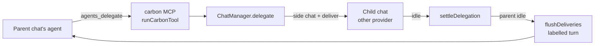

# Delegation

*Part of Carbon's design notes. The contract, the session flow and the provider
seams are in `CLAUDE.md`; the other surfaces are the neighbouring files in this
directory.*

### One chat's agent handing a task to another provider (`main/delegation.ts`)

An agent in any chat can call `agents_delegate` — "have Codex review this" — and
Carbon starts that task in a **new chat on the requested provider**, beside the
one that asked, then sends the outcome back to the asking chat when it ends.
`agents_send` gives an agent already started more work, by name;
`agents_status` lists a chat's agents; `agents_cancel` stops one. The
shape is T3 Code's `delegate_task`, built on what Carbon already had: the
`carbon` MCP server every provider is given, and the four provider sessions
behind `ChatManager`.

**The child is a side chat, not a new kind of chat.** It carries `sideOf` (the
parent's *thread* — the parent itself, or the thread a parent column belongs to)
and `ephemeral`, so everything `docs/threads.md` says about columns holds for
it: it persists, it reopens from the closed list, it is deleted with its thread.
What makes it a delegation is `ChatMeta.delegation` — the parent, the task, a
role, and the one outcome that is reported back. Main creates it, so the
renderer learns of it from a `chat-added` event, which only adds it to `chats`.

**It arrives minimized.** The child is a closed pill in the thread header (with
its working spinner) and a mark on the thread's sidebar row, and it becomes a
column only when the user opens it — the pill, or its card in the parent. It
used to open itself whenever the thread had room, and a turn that fanned out
three agents took three columns' width from the conversation being read, with
nobody having asked to watch them. The sidebar row marks every side chat that
is *working*, open or not (`renderChatItem`'s `busy`): marking open columns
alone meant minimizing an agent hid that it was still running.

**The child sees the task and nothing else.** Parent history is not copied; the
tool description says so, so the parent writes a complete brief. A
`delegateBrief` rides the child's first send as `hiddenContext` — who asked, and
that the final message is returned verbatim — so the child's transcript shows
the task alone.

**The user names models the way people do** — "ask Sol in Codex" — and the
parent has no catalog to translate that with, so a nickname sent straight
through as an id is a turn that fails on the other side. `resolveModel` matches
it against the provider's *live* catalog (loaded on demand, bounded at 15 s):
an exact id, then id or label ignoring case and spacing, then the first row
containing every word, which is the newest of a family because catalogs list
newest first. No match is an error listing the real ids, so the parent retries;
no catalog at all passes the name through.

With no `model` given, a delegate gets its provider's own default row
(`codex-default`, `grok-default`, …) rather than no model: an absent model is
the empty id, which every picker resolves to *Claude's* "Default" row — a Codex
delegate's composer chip read "Opus" until this was set.

**Its permission mode is the parent's**, never above it, and it runs in the
parent's cwd (and worktree). Delegation is **refused in plan mode**:
`agents_delegate` and `agents_cancel` are in the side-effect table
(`isAgentsSideEffect` → `isCarbonSideEffect`), the table every provider's
permission gate reads. That also means no delegate ever runs in plan mode, which
matters because a plan-mode child is a plan-review prompt on Claude and a plan
collaboration turn on Codex — neither of which is a delegate doing its task.
"Review, don't edit" is an instruction in the brief (`delegateBrief` adds it for
review/research roles), not a sandbox: a delegate in an editing mode can edit.

**One level only, enforced at the call.** A delegate's sessions are not offered
the `agents_*` tools (`canDelegate` is false for a chat with a `delegation`),
and `runCarbonTool` refuses them again when `ctx.delegate()` is false — the one
choke point both transports share, because an unlisted tool name is still a
name a model can send. The same live check is what makes the Settings switch
(**Settings → Chats → Agents can delegate**, `AppDefaults.allowDelegation`) bite
on a running session; whether the tools are *listed* is fixed at spawn.

### One chat, two forms: the card and the column (`DelegateCard`)

A delegate is drawn twice and is one chat both times. **Collapsed**, it is a
row in the parent's transcript where the `agents_delegate` call was — the
provider's avatar with a status dot, `name: task`, the state (Running, Needs
your approval, Finished · reported back, Failed, Stopped), and the round's
elapsed time. **Open**, it is its column. The row is a *toggle*, not a link:
clicking opens the column (from the thread's closed list) and clicking again
folds it back into the row; closing the column from its own ✕ leaves the row
standing, so a delegate put away is always one click from coming back. With
four chats already on screen the row says so instead of silently doing nothing.

Everything on it is the **child's** live state, read from its meta and status,
not the tool call's — the call returns the moment the agent starts, and the
question a reader brings to the row is whether that agent is still working,
waiting on them, or done. The child's id comes off the call's own result text
(`delegateChildId`), so a refused call has none and falls through to the
ordinary row that shows why.

Two transcript rules would have hidden it, and both are switched off for it:
`isGroupableTool` excludes `agents_delegate` (every `mcp__carbon__*` call folds
into an activity run otherwise, and a chat inside a collapsed group is a chat
nobody finds), and a settled turn's fold keeps it the way it keeps a
screenshot — an agent the turn started is a result, and the row is the way back
into it.

### Names, and talking to one agent among several

Several delegates can run at once — two Codex reviewers on two files is the
ordinary case — so each needs a handle that the **user** can say and the
**parent** can act on. Every delegate has a `name`, unique among its parent's:
the one the parent passed (`slugName`, so "Math Reviewer" is `math-reviewer`),
or `<provider>-<letter>` — `codex-a`, `codex-b`, `claude-a` (`autoName`). It is
the column's badge, the "finished" chip, the first words of every delivery and
of `agents_status`'s rows, so the word the user reads is the word the model
was told.

- **Letters, not numbers**, because the columns are numbered 1–4 and reorder by
  drag: a delegate called `codex-2` sitting in column 3 is a misdirection
  waiting for "tell 2…". Per provider rather than global, so `codex-b` reads as
  "the second Codex".
- **A reused name is refused, with the fix in the error**: a model passing a
  name that exists almost always meant the agent it already has, so the error
  names `agents_send`. A retried identical call (same provider, task and name)
  returns the running agent rather than tripping over its own name.
- **`resolveDelegate` is forgiving about spelling and strict about ambiguity**:
  an id, or the name as the user might type it ("Codex B", `codex_b`), or a bare
  provider only when exactly one delegate is on it.

**`agents_send` continues that agent's own conversation** — the point is that
it has the context the first round built, which a fresh `agents_delegate`
would not. The session rules and both tool descriptions steer the model to it
whenever the user refers to an existing agent, by name or by what it is doing.

- **A running agent gets the message queued into its current round**, and the
  round's one outcome covers both. That is why an outcome is read from the
  round's **opening prompt** (`Delegation.promptId`) rather than the last user
  message: read from the last one, a follow-up sent mid-run cut the report in
  half.
- **A finished agent is re-armed**: status back to `running`, the old result
  cleared, a new `promptId`, and its next outcome is delivered like the first.
  The previous round's report may not have reached the parent yet — it can have
  ended during the very turn that is now sending the follow-up. If it is riding
  a delivery turn already in flight the model has it, and it is dropped from
  that flight (or the re-armed round would be marked delivered when the turn
  settled); otherwise it is handed over in the tool result before being
  overwritten.
- It is refused in plan mode, and checks the parent the same way: an agent is
  found only among the calling chat's own. There is no cap on how many run at
  once, here or at `agents_delegate`: there was one (three per parent, sized
  to the four columns a thread shows), and it made the parent queue work the
  user had asked to run now — sized to a layout delegates no longer open into.

### How a delegation ends

`createSession`'s emit hook settles a delegated chat when it goes idle — the
`status: idle` / empty `background-jobs` pair the prune already keys on, with
`session.idle` re-read, so a Claude turn that ended with a background shell
still running is not over yet. It runs **after `pruneIdleSessions`, in the same
microtask**: delivering synchronously could hand a send to a parent session
whose `idle` had not flipped, which the prune would then dispose.

- **`delegationStarted`** guards the hook: an idle that lands before the
  child's turn has shown a non-idle status is a session announcing itself, not
  the task ending. A provider that cannot even construct (not installed) never
  emits through a session, so `deliver`'s catch settles it directly — and
  `delegate` turns that into the tool's own error rather than a delivery.
- **The outcome is read off the transcript** (`delegationOutcome`): every
  assistant text since the round's opening prompt, capped at 20 KB keeping the end
  (a report is written last), because a turn's final message often ends on a
  tool call with the findings one message earlier. An error event with nothing
  said after it is `failed`.
- **A stopped turn looks finished**, so `ChatManager.interrupt` records it in
  `delegationStopped` before the idle lands and the outcome is `cancelled` — the
  user pressed Stop in the column, and the parent is told so it does not wait
  forever. `agents_cancel` is the other cancel: the parent asked, so the record
  is settled *and* marked delivered first, and then the child's session is
  interrupted **and disposed**. An interrupt alone is best-effort — Grok and
  Antigravity have nothing to cancel while their client is still starting and
  would prompt the moment it came up — and "stopped" is a promise to the parent
  that nothing more runs. The transcript stays; a send in the column resumes it.
- **Any other disposal of a busy delegate settles it as stopped.** A disposed
  session emits no final status, so an effort change or a worktree exit
  mid-turn would have left it `running` with nothing to settle it;
  `disposeChat` settles it synchronously, ahead of the microtask the dispose's
  own `background-jobs` event queues (which would read it as finished).
- **Killing one** ("kill codex-a", "kill all the agents") is `agents_cancel`,
  which the tool description points at for every word a user uses for it —
  kill, stop, cancel, close, dismiss. A working agent is stopped; a finished
  one is not an error. Either way its column closes (`chat-close`) and nothing
  is deleted — the card in the parent reopens it, and `agents_send` can give it
  new work. `"all"` does every delegate of the parent's. A killed delegate is
  also **dismissed** (`Delegation.dismissedAt`): it leaves the thread header's
  closed pills, since a kill is "put it away" where a ✕ is only "not now" —
  its card in the parent and the ＋ list still reach it, and reopening it
  (`chats:undismiss`) or `agents_send` clears the mark. Deleting stays the
  user's own act, from the column's menu: a model mapping "kill" onto
  destroying a conversation would be a misheard word the user cannot undo.
- **Deleting a delegate** reports a running one to its parent as stopped
  (`forgetDelegation`, before the row goes, since the report is read off it).
  An outcome still unreported at that point — the parent was busy — is moved
  into the parent's `delegationInbox` rather than deleted with the row, and is
  delivered from there like any other.

### Delivery

An outcome goes back to the parent **as a turn of its own**, through `deliver`
with a label: the parent's transcript shows a chip ("Codex finished · review
src/math.js"), the model receives `deliveryText` — which opens with a sentence,
never a path, because the chip reads a leading `/` as a slash command. `deliver`
rather than `send`, for both this and the child's first prompt: `send` commits a
cross-provider pick armed in the composer and parses Codex slash commands, and
neither belongs to a message the app wrote.

- **"Idle" for a parent means between turns, not without background jobs**
  (`AgentSession.acceptsTurn`, `takesTurn`). Claude counts a backgrounded
  shell into `idle`, so a parent that had started a dev server — the ordinary
  case — never became idle again and never received a single report, while
  the user could send it a message at any moment. A delegate's *own* ending
  still waits for its background work: that is part of its task. A Claude
  **continuation** — the model woken by a background job's notification,
  with no turn of ours open — is busy for this purpose (`continuationLive`,
  from its first output to its result), or a report injected mid-continuation would be
  "answered" by output that was never its reply. Its status is `streaming`
  over the same span: it used to stay `idle`, so a delegate bisecting tests
  for ten minutes after its build finished showed spinning tool rows under a
  composer, foot and sidebar that all said it had stopped. The gap *before* that first
  output is covered too (`wakeTimer`, raised when a job leaves the set, up to
  30 s): the job set empties ahead of the wake, and its event runs
  `pruneIdleSessions` — so with more than two chats open, the one whose build
  had just finished was disposed while the CLI was dequeuing its notification,
  and the transcript stopped at "waiting for the build" for good. A turn's
  `result` deliberately leaves it raised, since a notification landing at the
  turn boundary gets its own continuation; the cost is that a job the turn
  absorbed holds the session busy (and a report due to it) for up to 30 s.
- **Where the provider can name what it answered, that is the word**
  (`AgentSession.promptAnswered`). Claude's result echoes the uuids of the
  prompts its turn consumed (the same ids `isStaleResult` reads), so a report
  counts as delivered once its own prompt is named — not because output
  appeared after it, which a continuation racing the injection produced: its
  uuid-less result closed the turn the report sat behind and its output was
  read as the reply. A prompt a live session has not named yet stays in
  flight; a disposed session's unnamed ones park. Providers that name nothing
  (and an older Claude CLI) keep the transcript rule, `promptReached`. A *failed* result names its prompt too, but is
  no evidence the model read it, so it counts as no answer (and parks the
  report) rather than as delivery. And idle-session pruning never disposes a
  parent with a report in flight, nor a Claude session mid-continuation (its
  `idle` excludes one): the answer to "was it delivered" lives on that live
  session.
- **Only an idle parent receives.** A busy one (mid-turn, waiting on a prompt,
  holding a plan review — a persisted `pendingPlanReview` counts even with no
  session behind it) gets everything due at its next settle, as one turn when
  several are due.
- **An outcome counts as delivered once the model has answered the turn that
  carried it**, not when the send was queued. A session taking a send only
  queues it — a Grok handshake or a Codex start can still fail afterwards, and
  the user can stop the turn while a handoff brief is resolving — so the
  outcomes ride `deliveryInFlight` until that turn settles, and `deliveredAt` is
  written only if `promptReached` — any assistant output between **the prompt
  that carried them** and the next one. Bound to that prompt's id rather than
  to "the last turn": a parent whose session is disposed (an effort change)
  before the prompt ran would otherwise have the user's next, unrelated answer
  vouch for it, and a disposal retires the flight on the spot for the same
  reason. If
  the turn never got that far, the parent is **parked**: automatic delivery
  stops, because re-sending at each idle would loop on a provider that cannot
  start or undo the user's Stop, and the outcomes ride the user's next send
  instead. While in flight they are excluded from `undelivered`, so a second
  settle cannot deliver them twice; the cost of keeping the flight in memory is
  that a quit mid-flight can, at worst, repeat one report on the next send
  rather than lose it.
- **A relaunch does not start turns.** A delegate still `running` on disk died
  with the last process; `reconcileDelegations` marks it `interrupted` at launch
  (skipping a chat another instance holds the lock on — `userData` is shared
  between builds — and looking again once the lease could have gone stale,
  since a lock left by an instance that crashed a moment ago looks identical
  to a live one). Outcomes nobody delivered then ride the parent's **next user
  send** as hidden context (`undelivered`), composed with a handoff brief if
  that send also switches provider, and marked delivered only if a session took
  it.

### Teardown

Disposing a busy delegate reports it as stopped, which delivers to its parent
— so two kinds of teardown switch that off rather than let it spawn sessions.
**Quitting** (`disposeAll` sets `shuttingDown`) leaves a running delegate
`running` on disk for the next launch's reconcile to call interrupted; reading
the dispose as an ending would report an unfinished task as completed and start
a parent turn on the way out. **Deleting a thread** (`markDeleting`, before any
of its chats is disposed) suppresses settling and delivery for every chat in
it, or a delegate column's disposal would deliver to the thread's own chat a
moment before its row went, spawning a session for a deleted conversation.
Signing out of Antigravity disposes through `disposeChat` for the same reason
any other disposal does.

Grok and Antigravity can be told to stop before they have a client: the
session is still registering with the bridge or completing the ACP handshake,
and `interrupt` has no session id to cancel. Both now refuse to build a client
once disposed and check `interrupted` immediately before `prompt` (inside the
sign-in retry, for Antigravity), which is the last point a prompt can be held.

**Idle-session pruning never disposes a running delegate's session**, and
Codex's `idle` counts a send still waiting on its context (`chainQueued`):
three delegations admitted in one tick each create a session, and the third's
prune read the first — prompt queued, not yet in `pending` — as idle, disposed
it, and swept the task before it ever ran.

### Admission

`agents_delegate` and `agents_send` are **serialized per parent** (`admit`).
The delegate path awaits the model catalog, and everything checked before that
await — the names in use, whether delegation is still on, the parent's mode,
whether the parent still exists — went stale across it: four calls in one turn
each saw an empty parent and all started as `codex-a`. Serialized, each sees the previous one's agent, and every check runs
*after* the await against the parent as it is now.

**The permission ceiling is re-applied at every follow-up**, against the
parent's mode at that moment (`MODE_RANK`): a delegate started under Full
access is narrowed before `agents_send` reaches it if the parent has since
been set to Ask.

**Kill stops the session, not the record.** A delegate whose round ended can
be put back to work by the user typing in its column — the record still says
`completed` while the session runs — so `agents_cancel` halts any busy session
whatever the record says. And `chat-close` in the renderer closes the column
without `closeSideChat`'s discard-if-unused branch: a slot still hydrating, or
a hidden window with its transcript events parked, looks unused, and a kill
promises nothing is deleted.

### Limits

Three running delegations per parent (a thread draws four columns), a 16 KB
task, and a duplicate running call — same provider, same task — answers with
the existing id rather than starting the work twice. A delegate shares the
checkout; parallel implementation work that needs isolation is a worktree the
user creates, not something `agents_delegate` provisions.

`demo/e2e/delegation.js` drives a real Claude → Codex review end to end (flip
its `PARENT`/`CHILD` for Codex → Claude) and asserts the column, the badge, the
outcome and the delivered turn. `demo/e2e/delegation-multi.js` starts two Codex
reviewers from one Claude chat and then has the user steer one of them by
name, asserting the follow-up reaches that agent's own chat through
`agents_send`, comes back as a second delivery, and leaves the other alone.
